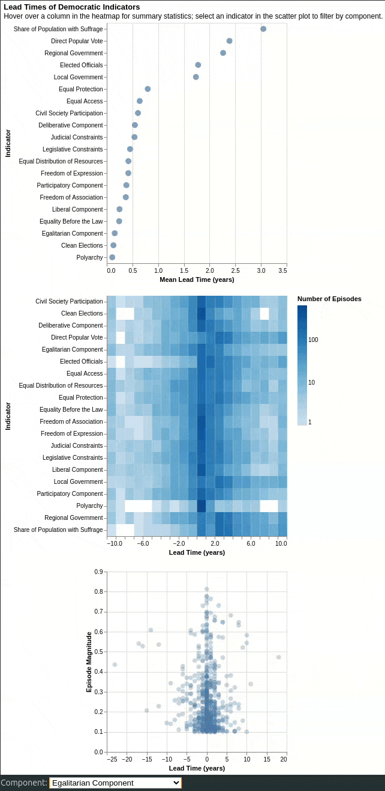
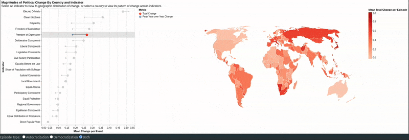
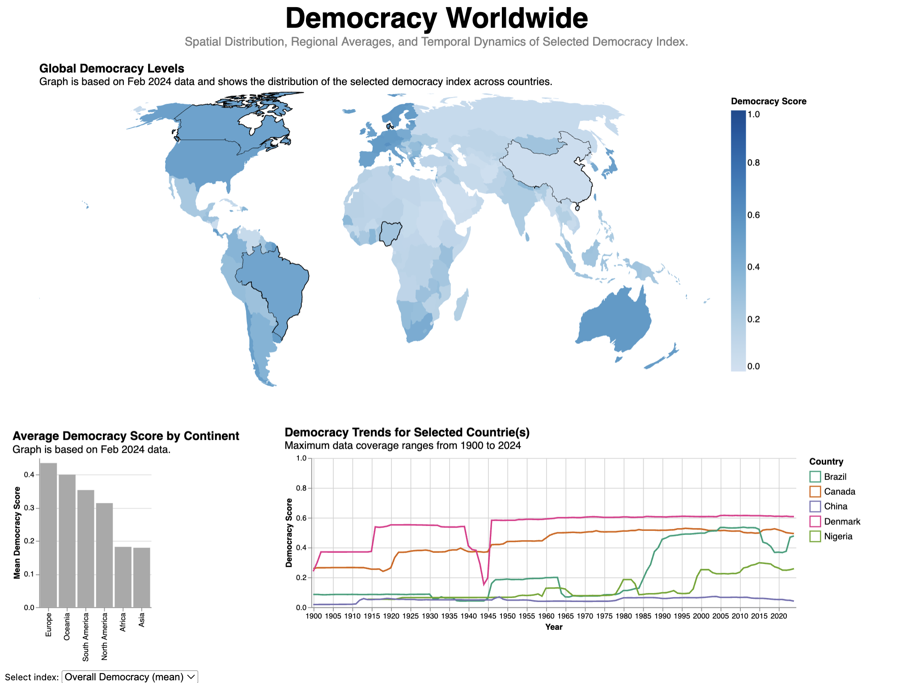
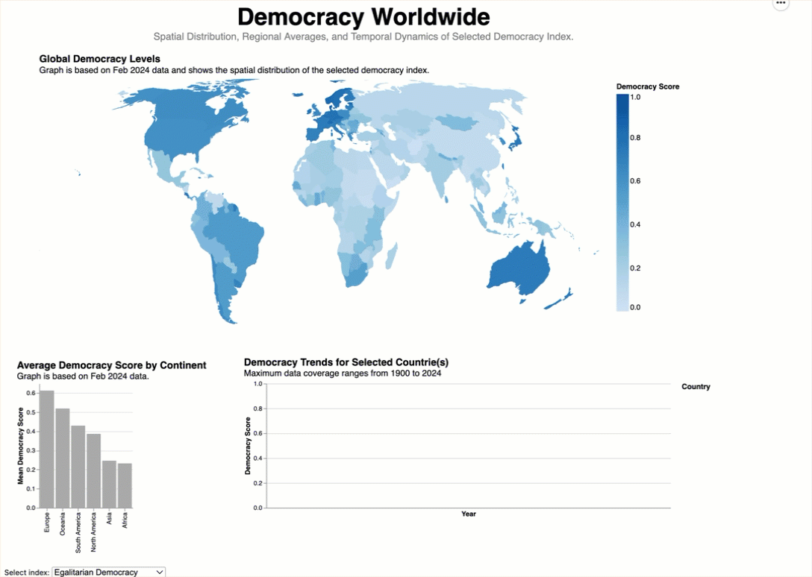
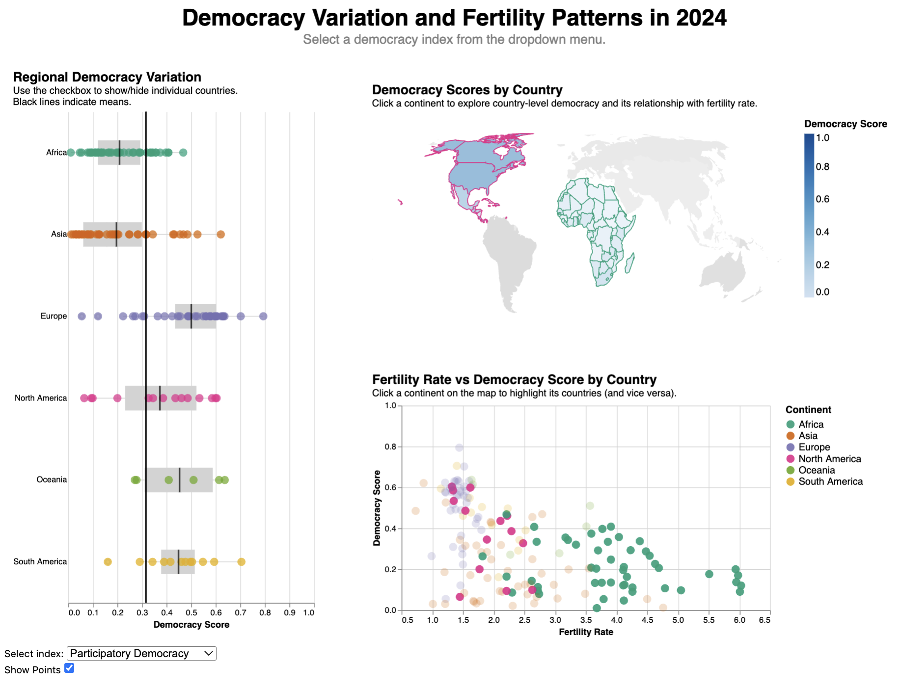
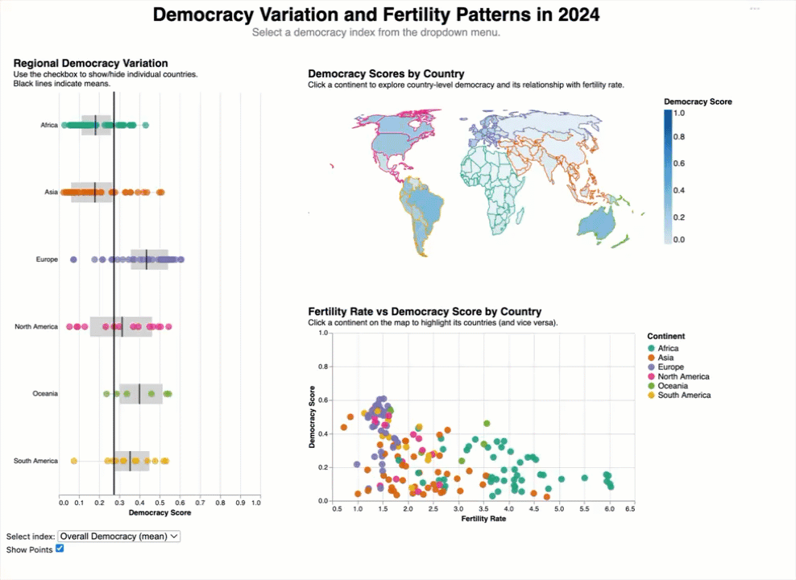

# Project Milestone 3 Report

## Overview

The Varieties of Democracy (V-Dem) Project is a global project working to collect comprehensive and high-quality data to study democracy and democratization of polities. The project is managed by 5 principle investigators but includes 23 project managers, 33 regional managers, 134 country coordinators, and more than 4200 country experts, which makes it one of the largest social science data collection projects on democracy. The main objective of this data collection project is to equip researchers with data that enables them to study why some countries become and remain democratic, while others do not.

The name, Varieties of Democracy, reflects how this project approaches democracy as a complex and multifaceted concept, beyond being a system of rule characterized by the simple presence of election.The approach centers on five high-level indices of democracy, each representing one core principle of democracy: electoral, liberal, participatory, deliberative, and egalitarian democracy. Each of these is made up of 4-5 constituent components, called mid-level indices. These mid-level indices are again are disaggregated into specific low-level indicators.

A special feature of the V-Dem Database is that it measures 600+ low-level indicators annually (beginning in 1789!) for all countries of the world. This makes it possible to study the complexity of democratization on a global level, throughout the last two centuries. For the purpose of our project, we have chosen to study a subset of the full dataset, detailed below. 

Our research team, Plot Twist, consists of three members: Jennifer Payne, Jacob Guglielmin and Sidsel Birkmose. Jennifer is interested in dimensions of democracy, Jacob is interested in episodes of democratic change, and Sidsel is interested in geographical aspects of democracy.

Our intended audience is broad; it might include fellow students and curious members of the public, alongside more specialist viewers like policy-makers or researchers. We expect they might be able to answer some of our analytic questions, after viewing our representations. 

------------
## Jacob 
### Theme: Temporal Patterns in Democratic Change
------------

This analysis investigates how different components of democracy tend to shift relative to the overall context of any particular episode of regime change. The goal is to identify which freedoms or institutional indicators lead or lag during democratic change, and how the magnitude and timing of these changes vary across countries and regions.

### Advanced Data Wrangling

Because this dataset is structured as country-year observations, significant data wrangling was required to create a summary of 'episodes' of democratic change. I chose to define an episode of change as a contiguous period where the electoral democracy index changed by at least 0.1 points over a span of years, without significant interruption or stalling. For each episode, the timing and magnitude of change for each democratic indicator being considered in our report were calculated relative to the overall change observed.

For the purposes of lead/lag analysis, I considered component change to be perfectly aligned in time if the maximum year-over-year change in the component occurred in the same year as the maximum change in the overall electoral democracy index. Leads and lags were then calculated as the difference in years between these peak changes. Additionally, the peak magnitude of change for those components was allowed to exist outside the episode window by a margin of 2 years (~33% of median episode length) to account for early or delayed effects.

### View I: Lead Times of Democratic Indicators

This view was designed to support answering the question "Which components tend to lead or lag overall regime change? Do some freedoms consistently shift earlier or later during the process?". While designing the view, I also considered additional questions such as "Are there patterns in the timing of these changes based on characteristics of the episode they belong to?" and "Do certain indicators show higher variability in their tendency to lead or lag?". To answer these questions, it was important to support the analytical tasks:

- Characterize distribution (compare trends in components)
- Find extremum (determine components which move earliest and latest)
- Find anomalies (identify components with unusual variability in lead/lag times)
- Correlate (explore relationships between episode magnitude and component timing)

This view includes 3 visualizations:

- A dot plot shows the distribution of mean lead/lag times for each component across all episodes.
        - The mark used is a point, with horizontal position encoding mean lead/lag time and vertical position encoding component type.
        - These choices were made to facilitate easy and accurate comparison of lead/lag times, especially due to the fact that this is the highest-level summary view.
- A heatmap shows the variability of lead/lag times for each component.
        - The mark used is area, with horizontal position encoding mean lead/lag time, vertical position encoding component type, and color encoding the logarithm of the count of episodes with that lead/lag time.
        - This choice was made to allow for quick identification of components displaying unusual variability, taking advantage of the ability to notice patterns in the color intensity.
- A scatter plot shows patterns in lead/lag times by the magnitude of the episode they belong to.
        - The mark used is a point, with horizontal position encoding lead/lag time and vertical position encoding episode magnitude.
        - This choice was made to allow for exploration of potential relationships between the size of democratic change and the timing of component shifts.

Interactions include:

- Selecting a component from the dropdown menu displays data for that component along the x-axis of the scatter plot.
        - This interaction was chosen to allow users to explicitly focus on components that may be of particular interest to them.
        - This primarily supports the correlate task, as users can see how lead/lag times for a specific component relate to episode magnitude.
- Hovering over a column in the heatmap displays summary statistics about the whole column, in addition to the cell.
        - This interaction was chosen to provide additional context about how lead/lag times are distributed.
        - This supports both the characterize distribution and find anomalies tasks, as users can see how a specific lead/lag time compares to the overall distribution, and additionally identify unusual patterns.

This view effectively supports the analytical tasks. Choices of marks and channels were made to facilitate accurate comparison and pattern recognition. Each viz is highly expressive for its intended purpose, and the interactions improve usability by allowing focus on specific components. To improve the view, it might be useful to add filtering options for episode characteristics, or to provide small-multiples, to better support finding anomalies.

### View II: Magnitudes of Political Change by Country and Indicator

This view was designed to support answering the question "Which dimensions of democracy are most resistant to decline during episodes of autocratization, and which are the most vulnerable?". While designing the view, I expanded this to include episodes of democratization as well, and considered additional questions such as "Are there regional patterns in the vulnerability or resilience of certain democratic components?" and "Do some components tend to change abruptly?". To answer these questions, it was important to support the analytical tasks:

- Characterize distribution (compare trends in components)
- Sort (to locate components which frequently or infrequently decline) 
- Find anomalies (determine components which are unusually resilient or weak)
- Cluster (explore regional patterns in component vulnerability/resilience)

This view includes 2 visualizations:

- A dumbbell plot shows the average magnitude of total change for each component during an episode of change, as well as the average peak year-over-year change for that component.
        - The mark used is primarily point - the horizontal line connecting the two points serves as a visual aid in this case rather than a data-encoding mark. Horizontal position encodes magnitude of change, and vertical position encodes component type.
        - These choices were made to facilitate easy and accurate comparison of component magnitudes, especially due to the fact that this is the highest-level summary view.
- A choropleth map shows the average magnitude of change for a selected component, broken down by country.
        - The mark used is area, with color encoding average magnitude of change for the selected component.
        - This choice was made to allow for quick identification of regional patterns in component vulnerability/resilience, taking advantage of the ability to notice patterns in color intensity.

Interactions include:

- Selecting an episode type using the radio buttons updates the entire view to show data for only the selected episode type (democratization or autocratization).
        - This interaction was chosen to allow users to explicitly focus on the type of regime change they are interested in.
        - This primarily supports the characterize distribution task, as users can see how component magnitudes differ between democratization and autocratization episodes.
- Selecting a component in the dumbbell plot updates the choropleth map to show data for that component.
        - This interaction was chosen to allow users to explore regional patterns for components of interest.
        - This supports both the cluster and find anomalies tasks, as users can see how a specific component's vulnerability/resilience varies by country.
- Selecting a country on the map filters the dumbbell plot to show data for that country only.
        - This interaction was chosen to allow users to focus on specific countries they are interested in.
        - This supports the characterize distribution task, as users can see how component magnitudes differ within a specific country.

This view also effectively supports the analytical tasks. While the marks and channels are not especially complicated, they are well-suited to effectively convey a large amount of information (for example, the length of the lines in the dumbbell plot allow an idea of how abrupt changes are for each component). The interactions improve usability by allowing focus on specific episode types, components, and countries. To improve the view, it might be useful to add additional filtering options for episode characteristics, or making more clear when there is no data in the map.

### Individual Summary

I think this was an interesting theme - it isn't one that really jumps at you as an obvious theme considering the structure of the data. The theme feels like it is a really meaningful (and timely) one: it is really important to understand how episodes of autocratization and democratization look if they are to be recognized early so that they can be prevented or encouraged. The data wrangling involved here was certainly the most complex part of this analysis, but it allowed for some interesting choices during visualization, like treating the component being examined as a variable that can be swapped in and out of views. I think both views I designed are effective at conveying information that is relevant, and I am happy with the way that the interactions allow for drilling down into more localized patterns.

It's really interesting that there were some real insights that came out of this analysis as well. For example, in the lead/lag view, it was interesting to see that changes to the effectiveness of regional/local governments both tend to lead overall change (which supports the idea that decentralization is an early step toward democracy). In the magnitude view, it was interesting to see that the freedoms of expression and association are among the most vulnerable components during autocratization episodes, which aligns with theories about how power becomes consolidated, but that those same components are also among those that tend to change the most during democratization episodes, suggesting they are also key areas of focus when building democratic institutions. Overall, I think this analysis provided some meaningful insights into the dynamics of democratic change.

------------
## Sidsel 
### Theme: Geopgraphical Aspects of Democracy
------------
### View I
**Title:** Democracy Worldwide: Spatial Distribution, Regional Averages, and Temporal Dynamics of Selected Democracy Index.

**Analytic Question:** What is the distribution of democracy across the world, and how does it vary between different aspects of democracy and over time?

#### Analytic Tasks
- Characterize distribution (mapping democracy scores)
- Correlate (comparing differences and similarities between aspects of democracy)
- Clustering (grouping similar countries/regions)
- Determine range (inspecting the global span of democracy scores)

The view created to address this question and low-level tasks comprises of:
1. A choropleth world map, suitable for characterizing spatial distributions and clustering similar countries. 
2. A bar chart, suitable for comparing regional average values. 
3. A line chart, suitable for comparing countries of interest over time. 

     <!-- two line breaks -->

     <!-- two line breaks -->

### Descriptions and critique of graphs and interactions

#### Visualization 1: Choropleth Map

The first and most eye-catching visualization of view I is a choropleth map showing the distribution of democracy scores across the world in 2024. The geoshape mark in Altair was used to create this graph and the color channel was utilized to encode the democracy score for each country. Since the democracy score is a quantitative, continuous variable in the range from 0 to 1, a sequential color scale was used to visualize the magnitude of the index. A tooltip was added, which allows the user to hover over the map and see the exact score for a given country of interest, as well as the continent to which the country belongs.
The user can interact with the map in several ways. Firstly, a dropdown menu allows the user to choose one of five different democracy indices (or the mean of these) to be visualized on the map. Secondly, the user has the option to click on a country (and multi-select by holding down the Shift button). This serves to filter the data shown in another visualization, a line chart, to be described further. 

The central encoding channel of this graph, the color channel, comes with its strengths and limitations. While the color encoding provides a useful overview of which countries and parts of the world that score highest and lowest on different democracy measures, it is not suitable for extracting exact values or comparing countries of similar scores, that don’t share a border. 
The color channel is highly expressive in that it accurately represents the democracy value, but it violates the effectiveness principle as it is very difficult to deduce the actual democracy value from looking at the color of a country. Another limitation of using color in this chart is the problem of separability. The use of color is always affected by the size of the colored item, which makes the perception of a country’s color biased according to the area of the country. The large variance in country sizes also poses a drawback to the interactivity with the chart, as the user’s ability to click-select a country is affected by the size of the country in the chart. A zoom-functionality or a separate search bar allowing the user to look up a specific country are possible ways to meet this limitation. 
Despite the discussed limitations, the color channel is considered the most suitable channel for showing the global distribution of democracy, its power being the ability to meaningfully show more than a hundred values in a single chart.
A somewhat subtle, however important, deficiency of this particular implementation is the fact that some countries aren't included in the built-in TopoJSON file used to create the choropleth. Countries like Greenland and Kosovo aren't included for example. 

     <!-- two line breaks -->

#### Visualization 2: Bar Chart 

The second chart of this view is a sorted bar chart, which shows the mean democracy value in 2024 per continent. In Altair, this is implemented using the bar mark. The x-channel is used to encode continents, while the mean democracy score per continent is encoded on the y-channel. This visualization makes use of the most accurate and effective magnitude channel for quantitative variables, position on a common scale. 
The data shown in this graph is filtered by the same dropdown, as used in for the world map, which makes it possible to hover over a country on the map and compare the country’s score with the mean of the corresponding continent, which is easy to read off the bar chart. The exact mean value can also be inspected by using the tooltip.

The sorted bar chart is very effective in visualizing and comparing the means for continents as the discriminability and accuracy of the position on a common scale channel is very high. However, the 100+ number of values in the dataset is reduced to 6 values that are being visualized in the bar chart. Each value is derived from a different number of observations, resulting in 6 mean values with different standard deviations. This may cause problematic or erroneous interpretations, as the user can’t consider standard deviation differences when comparing the length of two bars.
However, this simple bar chart aids the user with context and information, that isn’t readily seen, when looking at the map. Also, interpretation of the mean value in context of the map allows the user to identify possible outliers, which may have high influence on the calculated mean. 

     <!-- two line breaks -->

#### Visualization 3: Line Chart

The third visualization of View I allows the user is to inspect temporal patterns in the data for specific countries of interest. The temporal changes of a country’s democracy score are visualized by using the line mark. Time in years is encoded on the x-channel, while the democracy score is encoded on the y-channel. Up to five selected countries are encoded on the color channel, using a categorial color pallet, which excludes the color used for the sequential color pallet in the world map, to avoid interference between these color encodings. 
As mentioned, the data shown in this graph is controlled by the user’s interaction with the world map, in the form of a click-selection parameter. On the line chart, the user can also click on a specific line, which will single-select the corresponding country. Additionally, this graph’s data is also filtered according to the dropdown menu, making this a global parameter, which filters the data-input for all three visualizations constituting view I. 

While the strength of this line chart is the ability to visualize the democracy score trends for specific countries of interest, an obvious limitation is that the number of countries that can be displayed at the same time is very limited. Adding more than around five countries to the line chart will quickly make the chart difficult to interpret, both due to data clumping and difficulty distinguishing between many, more similar, colors. 
By design choice, the scale of the y-axis is fixed to span the interval of possible democracy score values (0 to 1). This is done to reduce the distortion of change blindness. By fixing the y-axis and thereby reducing the number of things that change in the view, when click-selecting, it becomes easier to notice the primary change, which is the addition/removal of a certain country.
However, a fixed y-scale may also cause inappropriate clumping of data, when comparing countries with similar trends that only vary within a small interval of the total range of values. This makes it difficult to see subtle, but maybe important, differences between similar countries. 

-------------------

### View II
**Title:** Democracy Variation and Fertility Patterns in 2024

**Analytic Question:** Which regions show the greatest internal variation in democracy? And how does this variation correlate with fertility rates?

#### Analytic Tasks
- Retrieve value (looking up democracy and fertility for a particular country)
- Compute derived value (compute mean and variance within each region) 
- Characterize distribution (show distributions within each region)
- Determine range (assess spread of democracy scores within each region)
- Find extremum (identify the regions with highest and lowest internal variation)
- Correlate (comparing democracy variation with fertility rates)

The view created to address this question and low-level tasks comprises of:
1. A boxplot of democracy scores by region, suitable for visualizing the spread and distribution of democracy scores.
2. A geospatial map showing the democracy score of each individual conutry. 
3. A scatterplot, showing the relationship between fertility rate and democracy score per country. 

     <!-- two line breaks -->

     <!-- two line breaks -->

### Descriptions and critique of graphs and interactions

#### Visualization 1: Boxplot 

The first visualization of view II is a horizontal boxplot of democracy scores by region in the year 2024, created in Altair by use of the boxplot mark. The x-channel was utilized to encode the democracy score, while continent is encoded on the y-channel. A point layer is added to the boxplot, showing the democracy value of each individual country within each continent. For the point layer, the continent is encoded on the color channel as well as the y-channel, using a qualitative color pallet with six levels. 
Finally, a third layer is added, which shows global as well as continental means. The global mean is visualized as a vertical black line spanning the full height of the chart, while continents’ means are shown as corresponding black ticks, spanning the box of the corresponding continent. 
The data shown in the boxplot is filtered according to a dropdown menu, which allows the user to inspect one of the five democracy indices or the mean value of the five. A second user interaction, a checkbox, is added, which allows to user to choose between showing or hiding the point layer.

This plot makes use of the most accurate and effective channels for visualizing and comparing quantitative data, position on a common scale and length. In the boxplot, the interquartile range is represented by the length of the box, which makes it easy to compare the variation in democracy scores between regions, though our perceptual ability to accurately compare lengths is much improved for aligned visual marks rather than unaligned, as in this case.
Some areas of improvement are the boxplot tooltip, which preferably should show the calculated quantiles with less decimals, and the point layer, which would show the distribution and amount of countries better if the points were scattered slightly along the y-axis. 

     <!-- two line breaks -->

#### Visualization 2: Choropleth map

This world map is identical to the central world map of view I and shows the democracy scores per country, which are encoded using a sequential color pallet. What’s different with this choropleth map is the colored country borders and the user interactions. 
Borders of countries that belong to the same continent have the same color. The qualitative color pallet used for the borders excludes the color of the sequential color pallet used to visualize the magnitudes of democracy scores.
The data shown in the map is filtered according to the infamous dropdown menu, and with this choropleth map, the user can click-select one or more continents as opposed to countries. Selection of one or more continents will highlight these continents from the rest while also serving as a filtering criterion for the data that is being highlighted in the third visualization of the view, to be described. 

An area of improvement for this chart is the coloring of the borders. With this implementation, all the borders are shown in colors by default. This makes it difficult to assess the fill color of a country and compare this to the color legend on the right to interpret what the democracy score value for that country is. It would be preferred to only have the colored borders shown for countries of selected continents. 
However, the colored borders improve the coherency of the full dashboard and helps to visualize how the selected data matches the data highlighted in the last plot. 

     <!-- two line breaks -->

#### Visualization 3: Scatter Plot

The last visualization, completing view II, is a scatterplot, which was implemented in Altair by use of the circle mark. This plot, with fertility rate encoded on the x-channel and democracy score on the y-channel, shows the relationship between these two attributes for individual countries. The color channel is again used to encode continents, using the same qualitative color pallet as in the two first visualizations, making the color encoding coherent across all three charts.
The scale of the y-axis is fixed, so that it spans the range of possible democracy score values [0,1]. This reduces the number of elements that change in the overall view when changing between different democracy indices. This aids the user’s ability to see how the encoded values change, when switching back and forth between democracy indices using the dropdown menu. This strengthens the possibility of comparing between democracy indices.  
The data shown in the scatterplot is also filtered according to the dropdown menu, which makes this a global parameter affecting all three visualizations of view II. Moreover, the user can interact directly with the scatterplot by clicking on the points. When clicking on a point, all countries in that corresponding continent are highlighted from the rest. This continent selection by clicking also affects the continent being highlighted in the aforementioned world map, making this direct interaction bi-directional between these two charts. 

The scatterplot makes use of the most accurate and effective encoding channel for visualizing quantitative data, which is position on a common scale. This makes it easy to accurately read of off the chart which of two countries have a higher fertility rate e.g. A possible improvement of the chart would be to add vertical lines to indicate continental means of fertility rate, colored according to the used continental color scheme. This would allow the user to quickly assess which countries have a higher or lower fertility rate than the average of countries in that continent. 

----------------

### Individual summary 
For this project I created two dashboards to explore the theme of geographical aspects of democracy based on the comprehensive V-Dem Project database. 

The focus of view I is to visualize the spatial distribution of global democracy levels as described by five distinct democracy indices, established by the V-Dem Project, and investigate temporal trends from the year 1900 until today. 
The view doesn’t tell a single cohesive story but is a very useful tool for anyone who is interested in exploring fluctuations in democracy levels for specific countries of interest and compare these with the global landscape of democracy. One might notice for example how the fluctuations of democracy levels in many European countries correspond well with some of the great wars. Or observations like a significant drop in the democracy level in Peru in the 1990s might give rise to novel research questions.

The aim of view II was to visualize the internal variation in democracy within the larger regions of the world and to investigate the correlation between democracy scores and fertility rates. The mean scores that are encoded on top of the boxplot is showing the same data as the bar plot in view I. However, this encoding additionally shows the distribution and variation in the data points as well as a global mean for comparison. The view reveals that there isn’t a strong correlation between fertility rate and democracy scores. It is evident, however, that no countries have both a high fertility rate and democracy score. The world map’s primary contribution is aesthetics, as the perception of the democracy scores encoded on the sequential color scale is highly distorted by the colored borders. Still, including this graph is justified by the way it supports the user’s navigation of the dashboard. 

----------------

## Jennifer

----------------
## Final Section

Our group produced six distinct but complementary views of democracy and related data. Each of our themes answers quite different analytic questions and operates at a different level of granularity, illustrating the range of approaches to exploring this enormously rich dataset.

Taken as a whole, the group of dashboards tells a layered story. At a high level, we learn how democratic components behave within individual countries and over time. Moving to lower level indices, we see how democracy varies across the world, exploring the nuances of periods of autocratization and democratization. We explore geographic differences both by country and by region. The combination of these views gives users both a big picture understanding, and a look into some of the many internal mechanics of democracy that this dataset allows us to explore. Taken together, the many representations give us significant breadth in our exploration; taken individually, we better understand democracy’s depth.

One obvious takeaway is that there is no single “best” representation for our data. Different visualizations (line charts, parallel coordinates, bar charts, scatter plots, choropleths etc) highlight very different facets of our dataset, and even different facets of the same attributes. By examining multiple views built from the same dataset, we saw how certain representations naturally support particular analytic tasks, while others reveal entirely different aspects. This made it clear that choosing a visualization is less about finding a universal best option, and more about matching structure to purpose.

A common thread through all our representations is the strength of interactivity as a tool for better understanding the data. We all came away with a stronger sense of how interactivity can support exploratory analysis: helping users filter, compare, and discover patterns that static plots might hide.
